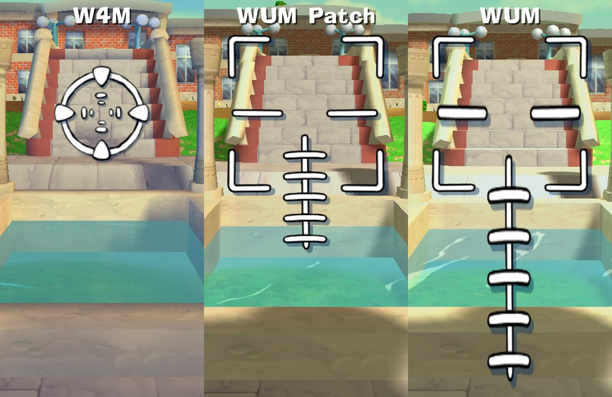
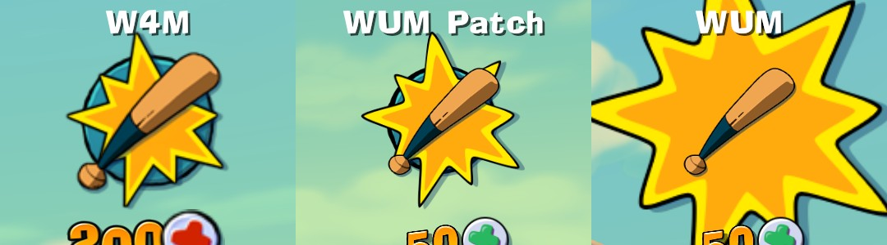

# Worms Ultimate Mayhem Anniversary Patch

  

Unofficial patch for Worms Ultimate Mayhem ([Steam](https://store.steampowered.com/app/70600)/[GOG](https://www.gog.com/game/worms_ultimate_mayhem_deluxe_edition)).

Supported EXE versions: **Steam/GOG #1077**.

## Features

### Modules

#### WUM.Patch

* **FrameInterval** - changes interval between frames to help with performance issues
* **HudAspectRatioFix** - stretches HUD (for ultra-wide resolutions)
* **DisableLetterbox** - removes letterboxing (for ultra-wide resolutions)
* **XSceneCameraFix** - fixes aspect ratio of the bomber scene
* **LandmineLodFix** - disables low-poly landmine model
* **UnlockAllLanguages** - adds all languages in the selection menu (American, Chinese & Korean are not actural translations, but they can be replaced with your own translation)
* **UnlockLoyaltyItems** - unlocks Alien Breed and Worms Reloaded loyalty items
* **Borderless** - disables window frames (only in windowed mode)

#### WUM.Loader

* Disables CRC checks
* Allows to load modified resources without replacing original files  
  Place modified XOM or TGA files in the `Data2` directory

### Shaders

* Removed surfaces gloss effect
* Removed rim-lighting effect
* Removed sepia effect

### Resources

* Fixed aimers, melee hit, worm select
* Changed weapon panel icons

### Tweaks

* Removed links *Achievements* and *DLC* from main menu

## Installation

The latest build can be downloaded from the [Releases](https://github.com/heatray/WUMPatch/releases) page.

Unpack the files to the **Worms Ultimate Mayhem** game directory, overwriting at the prompts.

Check the `WUM.Patch.ini` file for available features.

### Proton/Wine

For Steam, head to game’s properties and set **LAUNCH OPTIONS** to `WINEDLLOVERRIDES="dinput8=n,b" %command%` or `export WINEDLLOVERRIDES="dinput8=n,b"; echo WormsMayhem | xargs -I Launcher %command%`.

## Screenshots

<b>Patch</b>

**HUD aspect ratio fix, disabled letterbox**

**Bomber scene aspect ratio fix**

**Landmine LOD fix**

<b>Shaders</b>

<b>Resources</b>

